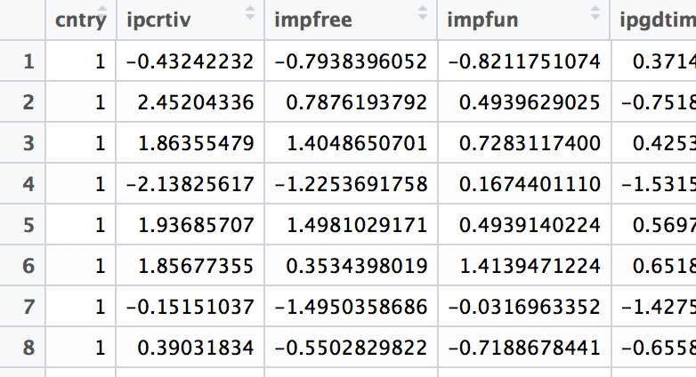

# MIE - Measurement invariance explorer (R package)

 To install, type in the RStudio console: `devtools::install_github("maksimrudnev/MIE.package", dependencies = TRUE)`


Invariance explorer helps to find groups that might demonstrate measurement invariance of latent factors.
Instead of repeatedly running the models to test invariance, one may plot the group measures and visually select the ones that are closer to each other.
* User may interactively include and exlude groups that look different (by clicking them), and the tool will automatically refit the models.
* To facilitate combination of groups, they are also clustered.

### Covariance-based approach
Usually, assessment of measurement invariance  is based on a measurement model (which is assumed to be a true model). However, one may employ completely exploratory approach, using covariances between observed variables to find groups with the most similar structures. This is the default (and the quickest) option in the ```Measurement invariance explorer```. Of course, at some point one has to specify a measurement model, but it may be done *after* finding a set of groups with similar covariance structures.

If, or when, a measurement model is given, one can use it in ```Measurement invariance explorer``` to find sets of groups that are closer to each other using either model parameters or model fit indices.

### Parameter-based approach
First, one has to specify measurement model using [lavaan syntax](http://lavaan.ugent.be/tutorial/syntax1.html). When you add a code, ```Measurement invariance explorer``` will automatically compute a common measurement invariance tests based on ```semTools``` package. Please, insert only ready-to-use model code, as computation may take a long time.
```Measurement invariance explorer``` computes configural model to compare factor loadings and metric model (with fixed factor loadings) to compare intercepts. It is recommended first be sure that you found a set of groups that have similar loadings before comparing intercepts.

### Fit indices-based
When using fit indices as a measure of group proximity, ```Measurement invariance explorer``` computes for each pair of groups either configural and metric models , or metric and scalar models, and plots the groups based on difference between less and more restricted models, as it was suggested by [Chen, 2007](http://citeseerx.ist.psu.edu/viewdoc/download?doi=10.1.1.459.8501&rep=rep1&type=pdf). Chen also suggested a threshold of .01. For convenience, a circle .01x.01 is added to the plot. If all the groups are inside this circle, it is very likely that measurement invariance holds for these groups. When using this approach, please check the actual fit indices, as the implied model is assumed to be true.

### Cautions
* As follows from its name, ```Measurement invariance explorer``` is exploratory. The plots are based basically on averaging a bunch of information, so it doesn't guarantee that closer groups have measurement invariance.
* When using implied models, pay attention to the fit indices themselves, not only to their differences. Model in general should fit data well enough.
* The use of some fit indices in plots based on multidimensional scaling and in cluster analysis might violate assumptions, as they have not been proven to have a normal distribution / sphericity.
* With big datasets and complex models lavaan could take _a considerable amount of time_ to get computations done. Be patient.
* One feature to be implemented is survey weights.

### Starting

To start, install the `MIE` package and run `runMIE()` function.

### Input data

Using arguments of function `runMIE()` it is possible to feed the app with the data objects stored in your R memory. For example: 
```
runMIE("F =~ impfree + iphlppl + ipsuces + ipstrgv", ess[, 4:15], group = "country")
```

Limit the data to the variables used in the models, because the app will attempt to compute covariance and correlation using all the variables except for group variable.


#### Uploading data within Shiny app

First column should include a group identifier, all the other columns should include indicators. Covariances are computed for all the indicators. When a model is implied, the data file might include any number of variables. However, it is recommended to keep file shorter to enhance a computation time. For example:



Here's a sample code to create data for the app in R from the data.frame:

```
write.csv(mydata[,c("country", "v1", "v2", "v3", "v4", "v5", "v6")], "fileforMIE.csv", row.names = F)
```

### Main purpose
This app is very useful when there are either clusters of groups or outlier groups (in terms of implied model/correlations).
The app is not very suitable for finding model misspecifications.

### Sister methods - mixture

For the more sophisticated model-based clustering see https://ppw.kuleuven.be/okp/_pdf/DeRoover2017MSFAF.pdf
However this method is limited to differences in factor loadings only, does not provide information on specific between-group distances, and is heavly dependent on a single model fit index (BIC). In practive this method is available only with proprietary software.

Another method was suggested by [Cheung & Rensvold (2000)](https://doi.org/10.5465/apbpp.2000.5535968), but it occured to be of little use.

<!---
## Technical manual #######

##### Storages ######
`dt` stores `dat` - the data read from external file, and `model` formula entered by user. It is updated every time data or model formula is entered, and sends its new values to all the functions that use it.

`vals` stores `keeprows` object - a vector containing subset of groups before and after including and excluding; and `excluded` vector of group names that are currently excluded from the graph and computations.

`modelStorage` stores results of the computed models in order to avoid repitition of computations (and save user's time).

##### Reactive objects #####
`selectedData` is used to subset the data. It reacts to changes in storage `dt$dat` and `vals$keeprows` and returns an object `selectedData()` containing subset of the data.


##### Listeners #####
Model fitting is done by functions in `observeEvent(input$measure`): depending on the selection of measure, it computes either covariance matrix, MGCFA configural model (and extracts factor loadings), MGCFA metric model (extracting intercepts), pairwise configural and metric MGCFA, or metric and scalar MGCFA (extracting difference in model fit indices).


# Bugs and further developments

Overall MGCFA is refitted each time the group is removed. Works properly only when Options is clicked.

The circle should be circle, fix the coord_equal everywhere. Now can be fixed with + and - tools.

-->


